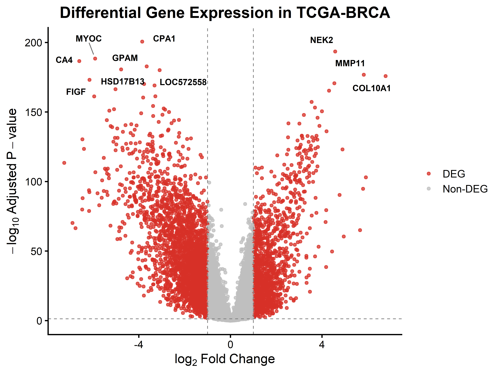
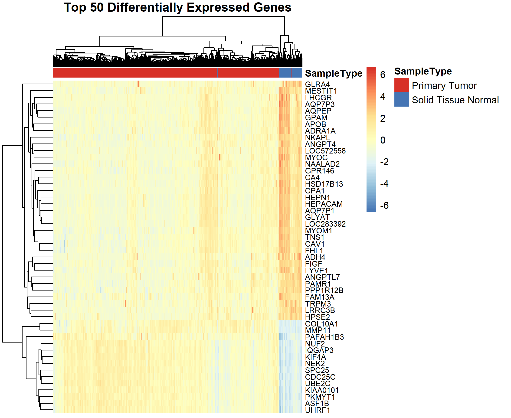
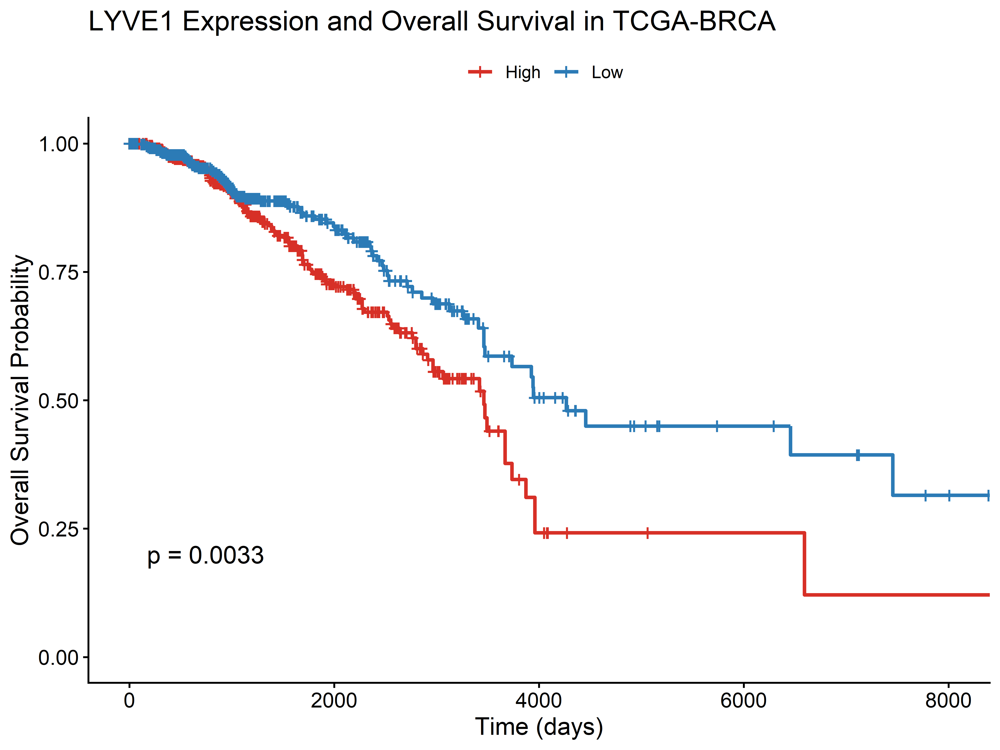
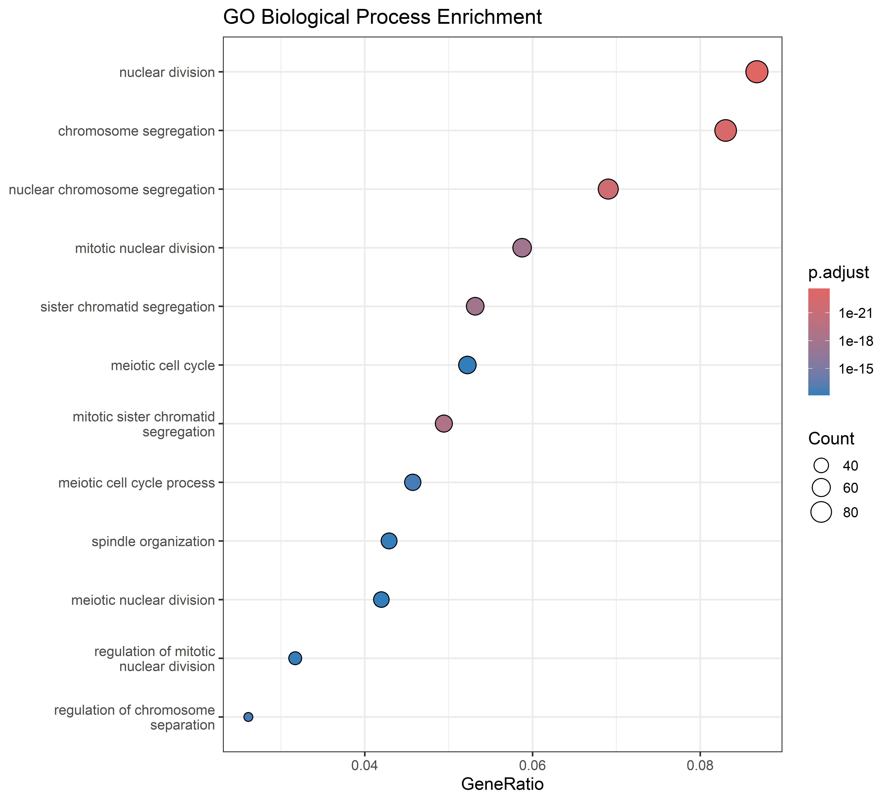
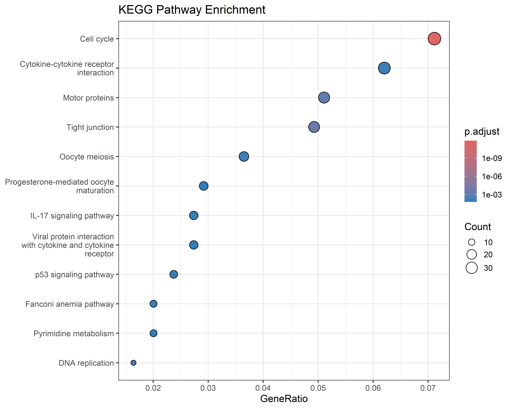

# Integrated Transcriptomic Analysis of TCGA Breast Cancer (TCGA-BRCA)

## About this project

Breast cancer is one of the most common cancers worldwide, and identifying genes associated with tumor development and patient survival is important for improving diagnosis and treatment.

In this project, I analyzed RNA-seq data from the TCGA Breast Invasive Carcinoma (TCGA-BRCA) dataset using R. The aim was to identify differentially expressed genes between breast tumor and normal tissues, evaluate their prognostic significance, and explore the biological pathways involved in breast cancer progression.

This project was completed as part of my bioinformatics portfolio to strengthen my skills in cancer transcriptomics and RNA-seq data analysis.

---

## Objectives

The main objectives of this project were to:

- Identify differentially expressed genes (DEGs) between tumor and normal breast tissues.
- Visualize gene expression changes using volcano plots and heatmaps.
- Identify genes associated with overall survival using Kaplan–Meier survival analysis.
- Perform Gene Ontology (GO) enrichment analysis.
- Perform KEGG pathway enrichment analysis.
- Interpret the biological significance of the identified genes and pathways.

---

## Dataset

The data used in this project were obtained from the TCGA Breast Invasive Carcinoma (TCGA-BRCA) dataset.

The following publicly available datasets were used:

- Gene expression data
- Clinical data
- Overall survival data

Due to the large file size, the raw datasets are not included in this repository. They can be downloaded from the UCSC Xena Browser or the Genomic Data Commons (GDC) Data Portal.
---

## Software and Packages

This project was performed in R using the following packages:

- limma
- survival
- survminer
- clusterProfiler
- org.Hs.eg.db
- enrichplot
- pheatmap
- ggplot2
- ggrepel

---

## Workflow

The overall workflow followed in this project was:

1. Download and preprocess TCGA-BRCA gene expression and clinical data.
2. Perform differential expression analysis using the **limma** package.
3. Visualize significant DEGs using a volcano plot.
4. Generate a heatmap of the top differentially expressed genes.
5. Screen differentially expressed genes for prognostic significance using Kaplan–Meier survival analysis.
6. Perform GO Biological Process enrichment analysis.
7. Perform KEGG pathway enrichment analysis.
8. Summarize and visualize the biological findings.

---

## Key Findings

The differential expression analysis identified several genes that were significantly dysregulated in breast cancer compared with normal breast tissue.

Kaplan–Meier survival analysis showed that **LYVE1** expression was significantly associated with overall survival, suggesting that it may have prognostic value in breast cancer.

GO enrichment analysis indicated that many significant genes were involved in biological processes related to:

- Nuclear division
- Chromosome segregation
- Mitotic cell cycle
- Cell division

KEGG pathway analysis showed enrichment of pathways involved in cancer progression, including cell cycle-related pathways.

These findings demonstrate how transcriptomic analysis can help identify potential biomarkers and improve our understanding of breast cancer biology.

---

## Repository Structure

```text
Integrated-Transcriptomic-Analysis-of-TCGA-Breast-Cancer-TCGA-BRCA-

├── figures/
├── results/
├── scripts/
└── README.md


---

## Figures

### Volcano Plot



---

### Heatmap of Top Differentially Expressed Genes



---

### Kaplan–Meier Survival Analysis (LYVE1)



---

### GO Biological Process Enrichment



---

### KEGG Pathway Enrichment



---

## Project Files

### Scripts

- 01_Data_Preprocessing.R
- 02_Differential_Expression_Analysis.R
- 03_Survival_Analysis.R
- 04_Functional_Enrichment.R
- 05_Heatmap_Visualization.R

### Results

- TCGA_BRCA_DEGs.csv
- TCGA_BRCA_top20_DEGs.csv
- TCGA_BRCA_Prognostic_Genes.csv
- GO_BP_Enrichment.csv
- KEGG_Enrichment.csv

---

## Skills Demonstrated

During this project I gained practical experience in:

- RNA-seq data analysis
- Differential gene expression analysis
- Cancer transcriptomics
- Survival analysis
- Functional enrichment analysis
- Biomarker discovery
- Data visualization in R
- GitHub project organization

---


## Challenges and Learning

During this project, one of the main challenges was organizing the TCGA expression data correctly for downstream analysis. I initially encountered issues with gene identifiers and expression matrices, which affected the differential expression and survival analyses. After resolving these problems, I successfully completed the complete workflow, including differential expression, Kaplan–Meier survival analysis, GO enrichment, KEGG pathway analysis, and data visualization.

Working on this project improved my understanding of transcriptomic data analysis in R and gave me practical experience in handling large-scale cancer genomics datasets.


---


## Future Improvements

In future, I plan to extend this analysis by:

- Performing differential expression analysis using raw HTSeq count data with DESeq2.
- Integrating immune infiltration analysis.
- Building machine learning models for biomarker prediction.
- Validating candidate biomarkers using independent datasets.

---


## Author

**Lopamudra Basu**

M.Sc. Biotechnology

Interested in Bioinformatics, Cancer Genomics, RNA-seq Analysis and Biomarker Discovery.
